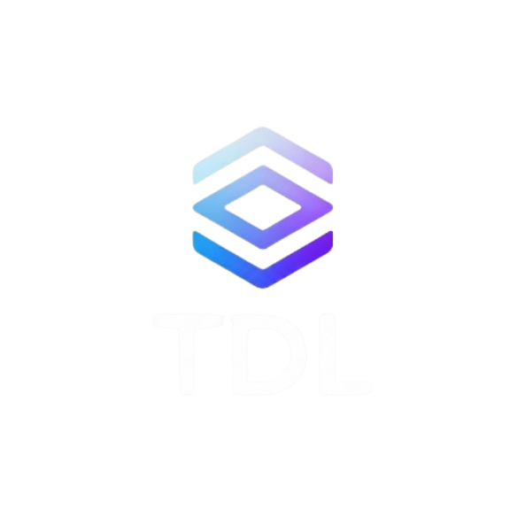
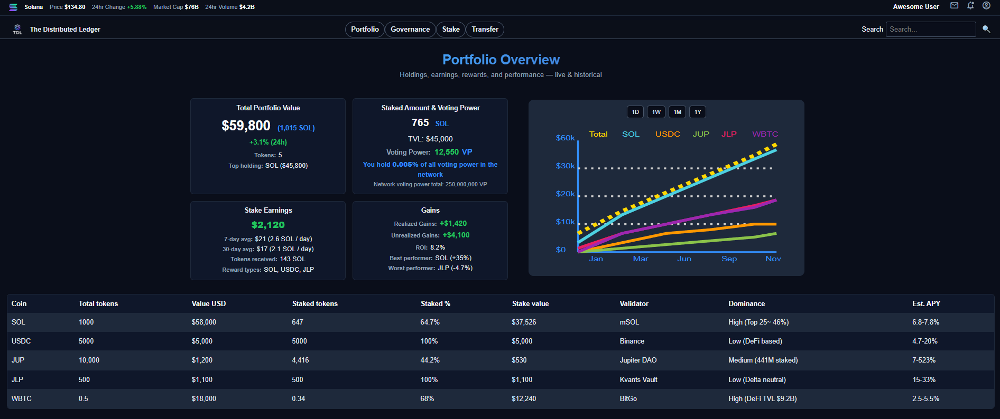
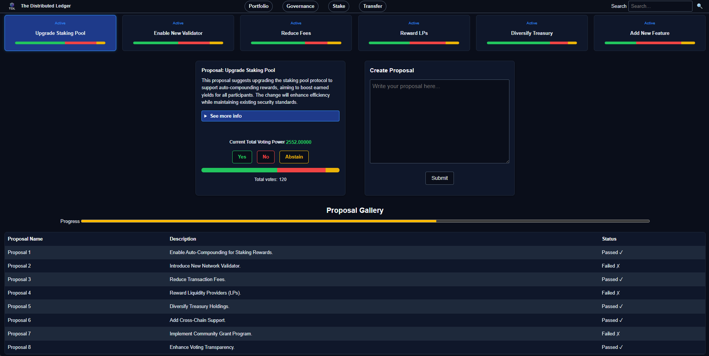
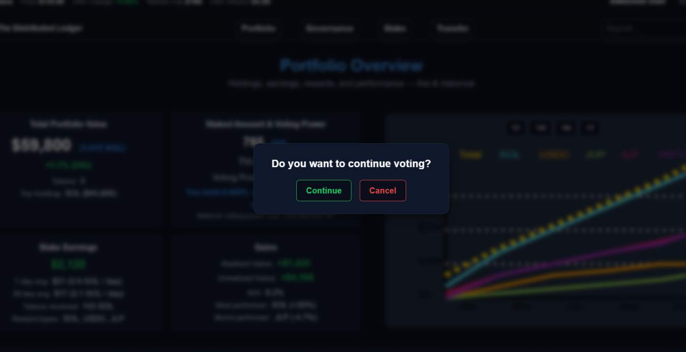
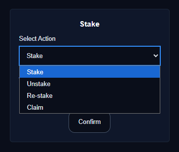
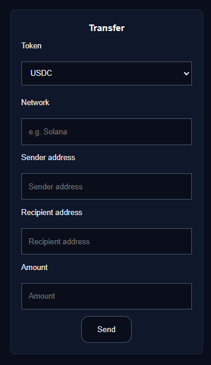
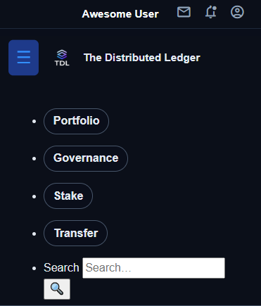

<a id="readme-top"></a>

<div align="center">
  <a href="https://github.com/Medieinstitutet/bcu25d-agila-grupparbete-bcu25d-the-distributed-ledger">
    
  </a>

  <h3 align="center">The Distributed Ledger</h3>

  <p align="center">
    A Solana portfolio dashboard. Track holdings, manage staking, vote on proposals, and transfer tokens.
    <br />
    Built with HTML and CSS.
    <br />
    <br />
    <a href="https://github.com/Medieinstitutet/bcu25d-agila-grupparbete-bcu25d-the-distributed-ledger">View Project</a>
    ·
    <a href="https://github.com/Medieinstitutet/bcu25d-agila-grupparbete-bcu25d-the-distributed-ledger">Report Issue</a>
    ·
    <a href="https://github.com/Medieinstitutet/bcu25d-agila-grupparbete-bcu25d-the-distributed-ledger">Request Feature</a>
  </p>
</div>

<details>
  <summary>Table of Contents</summary>
  <ol>
    <li><a href="#about">About</a></li>
    <li><a href="#built-with">Built With</a></li>
    <li><a href="#getting-started">Getting Started</a></li>
    <li><a href="#usage">Usage</a></li>
    <li><a href="#project-structure">Project Structure</a></li>
    <li><a href="#responsive-design">Responsive Design</a></li>
    <li><a href="#contributing">Contributing</a></li>
    <li><a href="#license">License</a></li>
    <li><a href="#contact">Contact</a></li>
  </ol>
</details>

## About

The Distributed Ledger is a portfolio dashboard for managing Solana tokens. It gives you a full view of your holdings, staked amounts, daily earnings, and unrealized gains all in one place. You can vote on governance proposals, manage your staking, and transfer tokens between wallets.

The whole thing is built from scratch using just HTML and CSS. No frameworks, no JavaScript, no npm. Just the basics done right.

<p align="right">(<a href="#readme-top">back to top</a>)</p>

## Built With

- HTML5 (semantic markup, ARIA labels for accessibility)
- CSS3 (Grid, Flexbox, custom properties, media queries)
- SVG (inline charts)

That's it. No dependencies. Just clean code that works.

<p align="right">(<a href="#readme-top">back to top</a>)</p>

## Getting Started

### Requirements

Just a modern web browser. Seriously, that's all you need.

Tested on:
- Chrome 90+
- Firefox 88+
- Edge 90+

### Installation

1. Clone the repo
   ```bash
   git clone https://github.com/your_username/distributed-ledger.git
   cd distributed-ledger
   ```

2. Open index.html in your browser
   ```bash
   # macOS
   open index.html
   
   # Linux
   xdg-open index.html
   
   # Windows
   start index.html
   ```

3. Or use Live Server in VS Code for development

That's it. No build process, no install step. File opens and you're good to go.

<p align="right">(<a href="#readme-top">back to top</a>)</p>

## Usage

The dashboard has four main sections:

### Portfolio
Overview of your holdings. Shows total value, what's staked, how much you're earning daily, and your realized and unrealized gains. All the data is simulated, but it works exactly like it would with real wallet data.



### Governance
Vote on active network proposals. You can see how many votes each option has, create new proposals, and check the history of past proposals. The voting interface shows the breakdown of Yes/No/Abstain votes in real time.



### Voting pop-up
Vote confirmation message pop-up. There's still no JavaScript but the pop-up is in the code (html/css) and with matching colors.



### Stake
Manage your tokens. Stake new amounts, unstake existing positions, restake to compound rewards, or claim your earnings. Works with SOL, USDC, WBTC, JUP, and JLP.



### Transfer
Send tokens to another wallet. Pick your token type, enter the recipient address, the amount, and hit send. Simple.



### Responsive Layout
The site adapts to any screen size. Navigation becomes a hamburger menu on mobile. Tables switch to card layout on small screens. Charts scale with the viewport.



<p align="right">(<a href="#readme-top">back to top</a>)</p>

## Project Structure

```
.
├── index.html      Main file with all sections
├── style.css       All styling and layout
├── TDLyes.jpg      Project logo
└── README.md       This file
```

### index.html

The HTML is split into clear sections:
- Header with market info and user controls
- Navigation with responsive hamburger menu
- Portfolio section with dashboard cards and chart
- Holdings table with all token info
- Governance section with proposals and voting
- Staking and transfer forms
- Footer

Uses semantic HTML and ARIA labels so it works with screen readers.

### style.css

All the styling in one file. Uses CSS custom properties for colors, Grid and Flexbox for layout, and media queries for responsiveness.

Color variables for easy theming:
- Dark backgrounds (rgb 10, 14, 26)
- Blue primary color (#3390ff)
- Green for positive gains, red for negative

Breakpoints at 768px and 960px handle mobile, tablet, and desktop views.

<p align="right">(<a href="#readme-top">back to top</a>)</p>

## Responsive Design

The site works across three main breakpoints:

| Screen Size | Width | Layout |
|---|---|---|
| Mobile | < 768px | Single column, hamburger menu, card-based tables |
| Tablet | 768px - 960px | Flexible 2-column, readable |
| Desktop | 960px+ | Full multi-column with everything visible |

Resize your browser to watch it adapt. All elements scale properly with no overflow issues.

<p align="right">(<a href="#readme-top">back to top</a>)</p>

## Contributing

Want to improve something? Go ahead.

1. Fork the repo
2. Create a branch: `git checkout -b feature/your-feature-name`
3. Make your changes
4. Commit: `git commit -m 'Add your change'`
5. Push: `git push origin feature/your-feature-name`
6. Open a pull request

Things to keep in mind:
- Keep HTML semantic and accessible
- Test on mobile using Chrome DevTools
- Validate HTML and CSS with W3C validators
- Comment complex CSS sections
- Keep code style consistent with what's already there

<p align="right">(<a href="#readme-top">back to top</a>)</p>

## License

MIT License. Do whatever you want with it.

<p align="right">(<a href="#readme-top">back to top</a>)</p>

## Contact

Kevin - [bigswefin@github](https://github.com/bigswefin)

Freddy - [SobrangGwapo@github](https://github.com/SobrangGwapo)

Tim - [silvergin7@github](https://github.com/silvergin7)

Bengt - [Bength65@github](https://github.com/Bength65)

Project Link: [liquidated-degens/the-distributed-ledger@github](https://github.com/Medieinstitutet/bcu25d-agila-grupparbete-bcu25d-the-distributed-ledger)

<p align="right">(<a href="#readme-top">back to top</a>)</p>

---

Built by Liquidated Degens for educational purposes.
