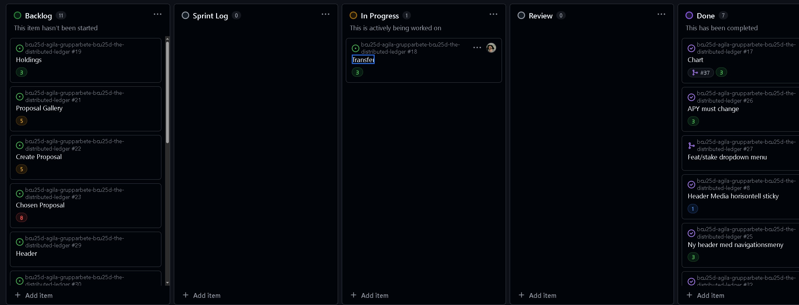

# Retrospektiv
Bild från vårat retrospektiv.

Sad: 

K: Inte haft mycket tid/mycket privat.

F: Okunskap leder till utdragna processer.

T: Utdragen daily standup / planering.

B: Github merge är problematiskt.

Glad:

K: Bra gruppdynamik och problemlösande.

F: Stegvis mer effektiva

T: Vi är på samma nivå kunskapsmässigt. Gemensam vision.

B: Bra ton i gruppen

Mad:

K: Github.

F: Github.

T: Github merge är problematiskt.

B: Github.

-ps, det är kort författat men vi har sysslat med problemlösningar i 3 timmar.