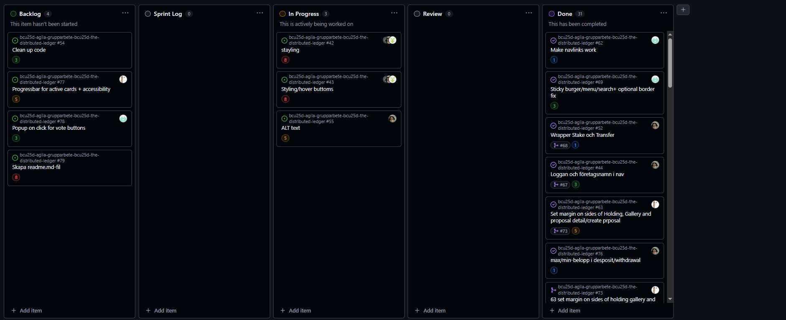

# Retrospektiv

Glad
- Kevin
Inga konflikter, det flyter på bra. Väl fungerande planering och daily stand-up.
- Freddy
Bra samarbete och villiga att hjälpa varandra med det vi kan/ ringa varandra och avsätta tid för att lösa saker gemensamt.
- Tim
Alla tar det seriöst och blir duktigare på agila metoder över veckornas gång. Även glad över att min förståelse av Github har blivit mycket bättre. 
- Bengt
Gruppen fungerar klockrent ihop. Alla är flexibla och lyssnar på varandra. Alla kommer till tals. 

Mad
- Kevin
Att man ofta fastnar i kod som är fel där felen egentligen är mycket mindre än vad man tror.
- Freddy
Kodkonflikter.. Att vi har kanske dålig kunskap om hur vi undviker det också även om det blir bättre med tiden.
- Tim
Jobbigt att kodkonflikter ständigt sker och att programmet inte tar hand om det automatiskt själv.
- Bengt
Blir irriterad när man inte hittar direkt just var det är man ska göra ändringen för att det ska få effekt.

Sad
- Kevin
Överoptimiskt på vissa "issues" i planeringen, där man underskattar hur avancerad eller lång tid den egentligen kommer ta.
- Freddy
Vi behöver nog vara mindre optimistiska och sluta snöa in på smådetaljer och istället fokusera mer på det agila arbetet och att lösa uppgiften vi fått. Detta känns generellt i gruppen och gäller även mig själv. Vi vill mycket och är ambitiösa. Men vi får inte glömma vad uppgiften och målet är.
- Tim
Att tiden börjar gå mot sitt slut och att det finns små grejer som man möjligtvis vill lägga tid på sidan. 
- Bengt
Att sidan bara är statisk och inte kommer bli komplett och aktivt använd, fungerande. 

Reflekterar över ändringar som skett i sprinten under veckan:

Vi har ständigt kommunicerat med varandra i Discord under veckan, där vi har tagit upp om något behöver ändras eller läggas till. Alla ändringar vi har gjort i sprinten har vi varit helt överens om. Discord är alltså egentligen vår typ av huvudkommunikation, utöver det har vi använt Teams för daily stand-up. 